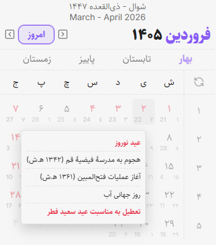
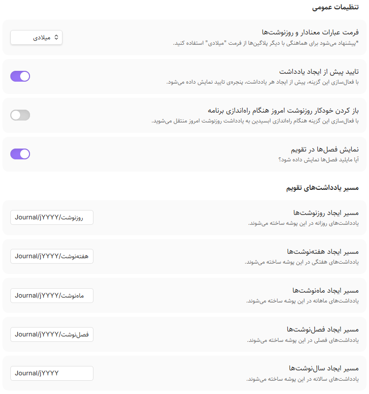
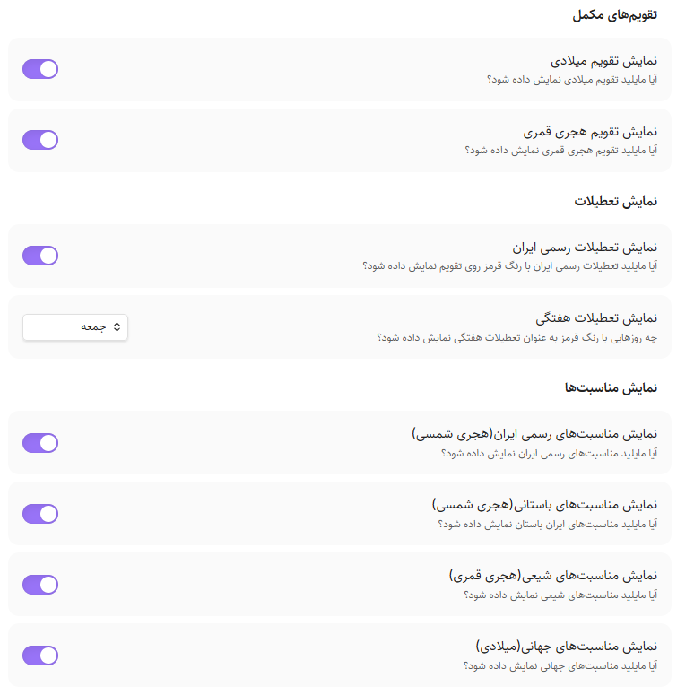
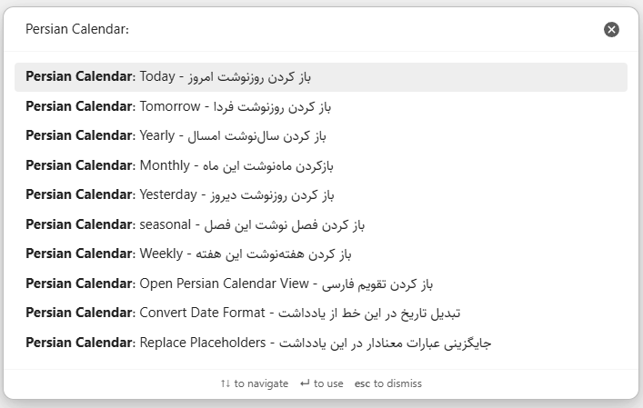
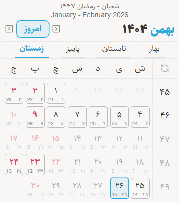

# Obsidian Persian Calendar

This tool lets you see events, add and organize notes from daily to yearly on the Persian calendar, use templates with placeholders, and works with all Obsidian daily plugins.

## Usage

- Can add daily, weekly, monthly, Seasonal and yearly notes based on Persian calendar.
- Modify path for creating notes.
- Can reference notes by typing `@` or selecting them.
- Can add {{placeholders}} in templates to enrich your templates. Works fine with [Templater](https://github.com/SilentVoid13/Templater) plugin for note templates.
- Works fine with all obsidian daily plugins.
- Works with Georgian and Hijri calendar in one view.
- Showing events of Iranian official calendar.

# افزونه تقویم فارسی ابسیدین

این افزونه تقویم فارسی را به [ابسیدین](https://obsidian.md/) اضافه می‌کند و شما می‌توانید بااستفاده از آن روزنوشت‌، هفته‌نوشت، ماه‌نوشت، فصل‌نوشت و سال‌نوشت تولید کنید و آن‌ها را مدیریت کنید، به آسانی به آن‌ها ارجاع دهید و نوشته‌هایتان را غنی‌تر کنید.

## قابلیت‌ها

- ایجاد یادداشت‌های روزانه، هفتگی، ماهانه، فصلی و سالانه
- برای یادداشت‌های روزانه و هفتگی موجود در فولدری که تعریف شده است یک نقطه زیر آن‌ها نمایش داده می‌شود.
- سازگاری کامل با افزونه Templater
- سازگاری با تم‌های اصلی ابسیدین
- امکان رفرنس دادن به یادداشت‌ها از طریق تایپ کردن '@' یا سلکت کردن عبارت‌ها برای قالب‌ها.
- امکان قرار دادن {{عبارت‌های معنادار}} در قالب‌ها برای غنی‌تر کردن یادداشت‌ها
- ذخیره‌سازی فایل‌های روزنوشت به میلادی برای سازگاری بیشتر با افزونه‌های ابسیدین
- قابلیت نمایش همزمان تقویم میلادی و قمری
- نمایش مناسبت‌ها تقویم شمسی و میلادی و هجری
- امکان تنظیم نمایش مناسبت‌ها

## راهنمای نصب

این افزونه در مخزن افزونه‌های ابسیدین نمایه شده است. برای نصب افزونه کافیست از طریق تنظیمات در بخش Community plugins نام Persian Calendar را جستجو کنید و افزونه را نصب کنید. بعد از فعالسازی افزونه در صورتی که افزونه را در سایدبار سمت چپ نمی‌بینید، با دستور «باز کردن تقویم فارسی» آن را در سایدبار باز کنید. پس از اجرای دستور، افزونه باید در سایدبار سمت چپ بالا به شما نمایش داده شود.

## راهنمای استفاده

پس از نصب افزونه اولین کار مهم تعریف مسیرهای ایجاد یادداشت‌های تقویم است. برای این کار به تنظیمات افزونه رفته و مسیرهای ایجاد فایل‌ها را مطابق توضیحات ایجاد کنید. امکان مسیردهی داینامیک یادداشت‌های تقویم به صورت سالانه، فصلی و ماهانه وجود دارد.
| مسیر داینامیک   | مقدار نمونه        | توضیحات                      |
| ------- | ----------- | -------------------------- |
| `jYYYY` | 1404        | سال شمسی به صورت چهار رقمی |
| `jQQQQ` | پاییز | نام فصل شمسی   |
| `jQQ`   | 03          | شماره‌ی فصل شمسی           |
| `jQ`    | 3           | شماره‌ی فصل شمسی   |
| `jMMMM` | آذر     | نام ماه شمسی         |
| `jMM`   | 09          | شماره‌ی ماه شمسی         |
| `jM`    | 9           | شماره‌ی ماه شمسی |

می‌توانید یا از طریق مسیردهی قالب درون تنظیمات یا از طریق افزونه [Templater](https://github.com/SilentVoid13/Templater) برای یادداشت‌های تقویم قالب تعیین کنید.

## آموزش استفاده به همراه افزونه Templater

با استفاده از افزونه [Templater](https://github.com/SilentVoid13/Templater) می‌توانید قالب‌های مشخصی را برای یاداشت‌های روزانه، هفتگی، ماهانه، فصلی و سالانه خود مشخص کنید:
کافیست افزونه [Templater](https://github.com/SilentVoid13/Templater) را نصب کنید و مطابق تصویر زیر برای هر نوع از فایل‌ها یک قالب به افزونه معرفی کنید. در نظر داشته باشید مسیرهایی که به افزونه معرفی می‌کنید با مسیرهای مشخص شده در تنظیمات افزونه یکسان باشد. حتما باید گزینه Trigger Templater on new file creation روشن باشد. برای غنی‌تر کردن قالب‌ها حتما بخش عبارت معنادار این افزونه را مطالعه کنید.

## امکان درج عبارت معنادار در قالب‌ها
میتوانید با درج عبارت‌های معنادار زیر تاریخ‌ها را در قالب‌ها اضافه کنید:

### **عبارات معنادار وابسته به روزنوشت**
فقط در روزنوشت کار می‌کند.
| عبارت | مقادیر نمونه | توضیحات |
| :--- | :--- | :--- |
| `{{تاریخ شمسی یادداشت}}` | 1404-11-30 | تاریخ روزنوشت را برمی‌گرداند. |
| `{{تاریخ میلادی یادداشت}}` | 2026-02-19 | تاریخ روزنوشت را برمی‌گرداند. |
| `{{تاریخ قمری یادداشت}}` | 1447-09-01 | تاریخ روزنوشت را برمی‌گرداند. |
| `{{روز هفته یادداشت}}` | پنجشنبه | نام روز هفته روزنوشت را برمی‌گرداند.
| `{{روز ماه یادداشت}}` | 30 | روز ماه یادداشت را برمی‌گرداند. |
| `{{مناسبت یادداشت}}` | (همان متنی که در مناسبات تقویم نمایش داده می‌شود) | مناسبت‌های روزنوشت را برمی‌گرداند. |

### **عبارات معنادار وابسته به هفته**
فقط در روزنوشت و هفته‌نوشت کار می‌کند.
| عبارت | مقادیر نمونه | توضیحات |
| :--- | :--- | :--- |
| `{{هفته یادداشت}}` | 1404-W49 | مشخصه‌ی هفته را برمی‌گرداند. |
| `{{اول هفته}}` | 2026-02-14 | روز اول هفته‌نوشت را برمی‌گرداند. |
| `{{آخر هفته}}` | 2026-02-20 | روز آخر هفته‌نوشت را برمی‌گرداند. |

### **عبارات معنادار وابسته به ماه**
فقط در روزنوشت و ماه‌نوشت کار می‌کند.
| عبارت | مقادیر نمونه | توضیحات |
| :--- | :--- | :--- |
| `{{ماه یادداشت}}` | 1404-11 | مشخصه‌ی ماه روز نوشت را برمی‌گرداند. |
| `{{نام ماه یادداشت}}` | بهمن | نام ماه روز نوشت را برمی‌گرداند. |
| `{{اول ماه}}` | 2026-01-21 | روز اول ماه‌نوشت را برمی‌گرداند. |
| `{{آخر ماه}}` | 2026-02-19 | روز آخر ماه‌نوشت را برمی‌گرداند. |

### **عبارات معنادار وابسته به فصل**
فقط در روزنوشت، ماه‌نوشت و فصل‌نوشت کار می‌کند.
| عبارت | مقادیر نمونه | توضیحات |
| :--- | :--- | :--- |
| `{{فصل یادداشت}}` | 1404-S4 | مشخصه‌ی فصل روز نوشت را برمی‌گرداند. |
| `{{نام فصل یادداشت}}` | زمستان | نام فصل روز نوشت را برمی‌گرداند. |
| `{{اول فصل}}` | 2025-12-22 | روز اول فصل‌نوشت را برمی‌گرداند. |
| `{{آخر فصل}}` | 2026-03-21 | روز آخر فصل‌نوشت را برمی‌گرداند. |

### **عبارات معنادار وابسته به سال**
در روزنوشت، هفته‌نوشت، ماه‌نوشت و سال‌نوشت به درستی کار می‌کند.
| عبارت | مقادیر نمونه | توضیحات |
| :--- | :--- | :--- |
| `{{سال یادداشت}}` | 1404 | سال یادداشت را برمی‌گرداند. |
| `{{اول سال}}` | 2025-03-21 | روز اول سال را برمی‌گرداند. |
| `{{آخر سال}}` | 2026-03-20 | روز آخر سال را برمی‌گرداند. |

### **عبارات معنادار زمان حال**
| عبارت | مقادیر نمونه | توضیحات |
| :--- | :--- | :--- |
| `{{تاریخ شمسی جاری}}` | 1404-11-26 | تاریخ شمسی جاری را برمی‌گرداند. |
| `{{تاریخ میلادی جاری}}` | 2026-02-15 | تاریخ میلادی جاری را برمی‌گرداند. |
| `{{تاریخ قمری جاری}}` | 1447-08-26 | تاریخ قمری جاری را برمی‌گرداند. |
| `{{روز هفته جاری}}` | یکشنبه | نام روز هفته امروز را برمی‌گرداند. |
| `{{روز ماه جاری}}` | 26 | روز ماه امروز را برمی‌گرداند. |
| `{{هفته جاری}}` | 1404-W49 | مشخصه‌ی هفته جاری را برمی‌گرداند. |
| `{{نام ماه جاری}}` | بهمن | نام ماه جاری را برمی‌گرداند. |
| `{{ماه جاری}}` | 1404-11 | مشخصه‌ی ماه جاری را برمی‌گرداند. |
| `{{نام فصل جاری}}` | زمستان | نام فصل جاری را برمی‌گرداند. |
| `{{فصل جاری}}` | 1404-S4 | مشخصه‌ی فصل جاری را برمی‌گرداند. |
| `{{سال جاری}}` | 1404 | سال جاری را برمی‌گرداند. |
| `{{مناسبت جاری}}` | (همان متنی که در مناسبات تقویم نمایش داده می‌شود) | مناسبت‌های امروز را برمی‌گرداند. |

### **روزهای گذشته و باقیمانده**
به صورت پیشفرض به تاریخ روزنوشت وابسته هستند اما اگر در روزنوشت نباشند نتیجه را براساس تاریخ جاری نمایش می‌دهند.
| عبارت     | مقادیر نمونه | توضیحات    |
| :--- | :--- | :--- |
| `{{روزهای گذشته سال}}`     | 334 | تعداد روزهای گذشته از ابتدای سال را برمی‌گرداند.     |
| `{{روزهای باقیمانده سال}}` | 31  | تعداد روزهای باقی‌مانده تا پایان سال را برمی‌گرداند. |
| `{{روزهای گذشته فصل}}`     | 58  | تعداد روزهای گذشته از ابتدای فصل را برمی‌گرداند.     |
| `{{روزهای باقیمانده فصل}}` | 31  | تعداد روزهای باقی‌مانده تا پایان فصل را برمی‌گرداند. |
| `{{روزهای گذشته ماه}}`     | 28  | تعداد روزهای گذشته از ابتدای ماه را برمی‌گرداند.     |
| `{{روزهای باقیمانده ماه}}` | 2   | تعداد روزهای باقی‌مانده تا پایان ماه را برمی‌گرداند. |

## امکان ارجاع به یادداشت‌ها از طریق تایپ کردن '@' یا انتخاب کردن

میتوانید از طریق تایپ کردن نویسه '@' در وسط نوشته‌ها به یادداشت‌های خود ارجاع دهید. یادداشت‌های پشتیبانی شده تا به امروز:

- روزهای جاری به صورت `امروز`، `دیروز`، `فردا`، `پریروز` و `پس‌فردا` (هماهنگ با تنظیم میلادی و خورشیدی)
- روزهای هفته:روز هفته(روز هفته جاری)، روز هفته بعد، روز هفته قبل (هماهنگ با تنظیم میلادی و خورشیدی)؛ نکته: اگر مثلا دوشنبه باشد و شما یکشنبه را انتخاب کنید یکشنبه بعدی انتخاب می‌شود. یکشنبه ای که گذشته است در تعریف این افزونه یکشنبه گذشته است و باید از عبارت یکشنبه قبل استفاده کنید.
- هفته‌ها به صورت `این هفته`، `هفته قبل` و `هفته بعد`
- ماه‌ها به صورت `این ماه`، `ماه قبل` و `ماه بعد`
- فصل‌ها به صورت `این فصل`، `فصل قبل` و `فصل بعد`
- سال‌ها به صورت `امسال`، `سال قبل` و `سال بعد`
همچنین میتوانید با انتخاب کردن عبارت‌های فوق را به روزنوشت‌ها لینک کنید. مثلا اگر فردا را انتخاب کنید و انتخاب دستور مرتبط یادداشت‌ها را لینک کنید. فیلم زیر را برای درک بهتر این موضوع ببینید. در نظر داشته باشید به صورت پیش‌فرض این افزونه فایل‌ها را نمی‌سازد و خودتان باید فایل‌ها را ازطریق افزونه بسازید.

## امکان نامگذاری یادداشت‌ها بر اساس تقویم میلادی

بسیاری از افزونه‌های ابسیدین بر اساس تاریخ میلادی فعالیت می‌کنند. در تنظیمات می‌توانید مشخص کنید که یادداشت‌ها به صورت میلادی نام‌گذاری شوند و با استفاده از `{{عبارت‌های معنادار}}` تقویم شمسی را به آن‌ها اضافه کنید. می‌توانید با انتخاب این موضوع تمامی قابلیت‌های افزونه را هماهنگ با افزونه‌های مختلف ابسیدین که با روزنوشت‌ها کار می‌کنند داشته باشید.

## دستورات تعریف شده در افزونه

برای سهولت در دسترسی به فایل‌های روزهای مختلف دستورات زیر در افزونه قرار دارد که می‌توانید برای آن‌ها شورتکات تعریف کنید.

- دسترسی به روزنوشت، هفته‌نوشت، ماه‌نوشت، فصل‌نوشت و سال‌نوشت جاری
- ارجاع متن انتخاب شده به یادداشت مرتبط
- تبدیل تاریخ بین شمسی و میلادی به صورت خودکار و با فرمت `YYYY-MM-DD` . (سال بیشتر از 1600 میلادی و کمتر از آن شمسی است. این حرکت اشتباه اما کار راه‌اندازتر است!)

## قابلیت نمایش تقویم میلادی

اگر از تقویم میلادی زیاد استفاده می‌کنید و می‌خواهید همزمان در افزونه تقویم میلادی نمایش داده ‌شود می‌توانید در تنظیمات افزونه با فعال‌سازی آن، تقویم میلادی را در کنار تقویم شمسی داشته باشید.

## قابلیت نمایش تقویم قمری و میلادی به صورت همزمان

در تنظیمات تقویم میتوانید مشخص کنید تقویم قمری نمایش داده شود یا خیر. این تنظیمات باعث میشود که بتوانید در کنار تقویم شمسی و میلادی تقویم قمری را هم داشته باشید.

## تنظیم نمایش مناسبت‌های در تقویم

مناسبت‌های تقویم ایران به این افزونه اضافه شده است. میتوانید تنظیم کنید در تولتیپ (وقتی موس را روی روز قرار می‌دهید باکسی نمایش داده می‌شود که به آن تولتیپ می‌گویند) چه مناسبت‌هایی را نمایش دهد. به صورت معمول سه دسته مناسبت در تقویم ایران وجود دارد:

- مناسبت‌های تقویم رسمی: این مناسبت‌ها به صورت رسمی در کشور تصویب شده‌اند
- مناسبت‌های باستانی:‌ مناسبت‌های که در تقویم باستانی ایران وجود دارد
- مناسبت‌های شیعی: مناسبت‌هایی که در تقویم شیعیان درج شده است و با تقویم هجری تنظیم شده است. تقویم رسمی ایران با برخی از مناسبت‌های شیعی تقارن دارد. بنابراین اگر مایلید مناسبت‌های تقویم رسمی ایران را داشته باشید همزمان مناسبت‌های شیعی را فعال کنید.

## مسیر مشارکت در توسعه افزونه

این افزونه به صورت رایگان و برای مقاصد غیرتجاری و مطابق [این لایسنس](LICENSE) توسعه یافته است و با مشارکت شما کامل‌ می‌شود. در تب Issues همین مخزن می‌توانید ایده‌ها و باگ‌ها را گزارش کنید. هم‌چنین در تلاشم در سایت و فروم [کارفکر](https://karfekr.ir) مطالب مرتبط با ابسیدین را به اشتراک بگذارم. اگر مایل هستید که توسعه دهنده این افزونه را حمایت کنید [کارفکر](https://karfekr.ir) را دنبال کنید.

