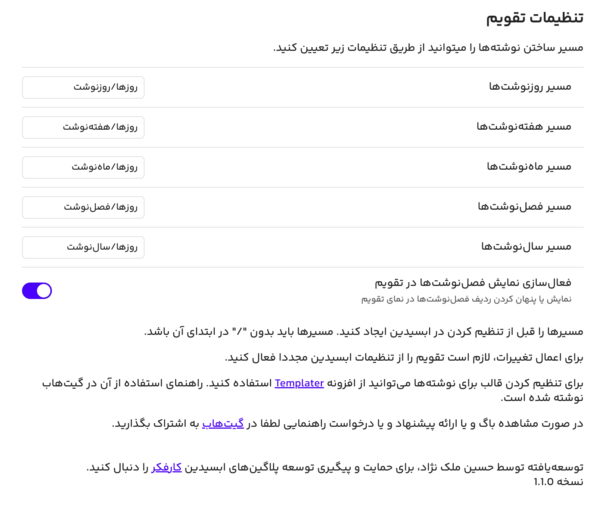
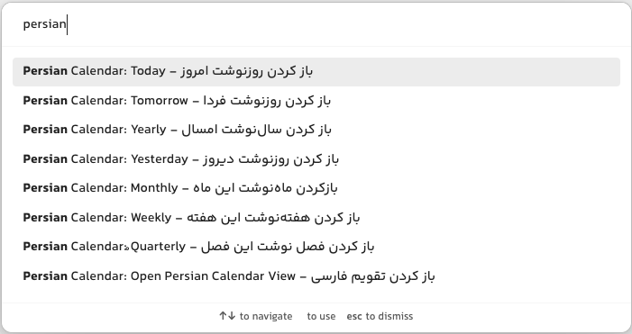

# Obsidian Persian Calendar

This Obsidian plugin gives you a simple and useful view for working with periodic notes on solar calendar.

## Usage

- Can add daily notes, a dot shows existing daily notes.
- Can add weekly notes, a dot shows existing weekly notes.
- Can add monthly notes by clicking on month.
- Can add quarterly notes by clicking on quarters.
- Can add yearly notes by clicking on year.
- Modify path for creating notes.
- Works Fine with [Templater](https://github.com/SilentVoid13/Templater) Plugin for note templates.

# پلاگین تقویم فارسی ابسیدین

این پلاگین تقویم فارسی را به [ابسیدین](https://obsidian.md/) اضافه می‌کند و شما می‌توانید بااستفاده از این پلاگین روزنوشت‌، هفته‌نوشت، ماه‌نوشت، فصل‌نوشت و سال‌نوشت تولید کنید و آن‌ها را مدیریت کنید.  

## قابلیت‌ها

- قابلیت ایجاد یادداشت‌های روزانه، هفتگی، ماهانه، فصلی و سالانه
- برای یادداشت‌های روزانه و هفتگی موجود در فولدری که تعریف شده است یک نقطه زیر آن‌ها نمایش داده می‌شود.
- سازگاری کامل با افزونه Templater
- سازگاری با تم‌های اصلی ابسیدین

## راهنمای نصب

این افزونه در مخزن افزونه‌های ابسیدین نمایه شده است. برای نصب افزونه کافیست از طریق تنظیمات در بخش Community plugins نام Persian Calendar را جستجو کنید و افزونه را نصب کنید.

## راهنمای استفاده

پس از نصب افزونه اولین کار مهم تعریف مسیرهای ایجاد فایل‌هاست. به این منظور به تنظیمات افزونه رفته و مسیرهای تولید فایل‌ها را مطابق توضیحات درج شده مشخص کنید. قبل از تنظیم مسیر، آن را در ابسیدین ایجاد کنید و برای تعریف کردن مسیر ابتدای آن / نگذارید .
پس از مشخص کردن مسیرها برای مشخص کردن قالب تولید افزونه [Templater](https://github.com/SilentVoid13/Templater) را نصب کنید و مسیر قالب‌ها را مشخص کنید.

## آموزش استفاده به همراه افزونه Templater

با استفاده از افزونه [Templater](https://github.com/SilentVoid13/Templater) می‌توانید قالب‌های مشخصی را برای یاداشت‌های روزانه، هفتگی، ماهانه، فصلی و سالانه خود مشخص کنید:
کافیست افزونه [Templater](https://github.com/SilentVoid13/Templater) را نصب کنید و مطابق تصویر زیر برای هر نوع از فایل‌ها یک قالب به افزونه معرفی کنید. در نظر داشته باشید مسیرهایی که به افزونه معرفی می‌کنید با مسیرهای مشخص شده در تنظیمات افزونه یکسان باشد. حتما باید گزینه Trigger Templater on new file creation روشن باشد.

## دستورات تعریف شده در افزونه

برای سهولت در دسترسی به فایل‌های روزهای مختلف دستورات زیر در افزونه قرار دارد که می‌توانید برای آن‌ها شورتکات تعریف کنید. 

## مسیر مشارکت در توسعه پلاگین

این پلاگین به صورت رایگان و برای مقاصد غیرتحاری توسعه یافته است و با مشارکت شما کامل‌ می‌شود. در تب Issues همین مخزن می‌توانید ایده‌ها و باگ‌ها را گزارش کنید. هم‌چنین در تلاشم در سایت و فروم [کارفکر](https://karfekr.ir) مطالب مرتبط با ابسیدین را به اشتراک بگذارم. اگر مایل هستید که توسعه دهنده این پلاگین را حمایت کنید [کارفکر](https://karfekr.ir) را دنبال کنید.