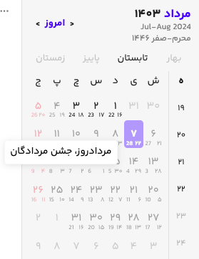
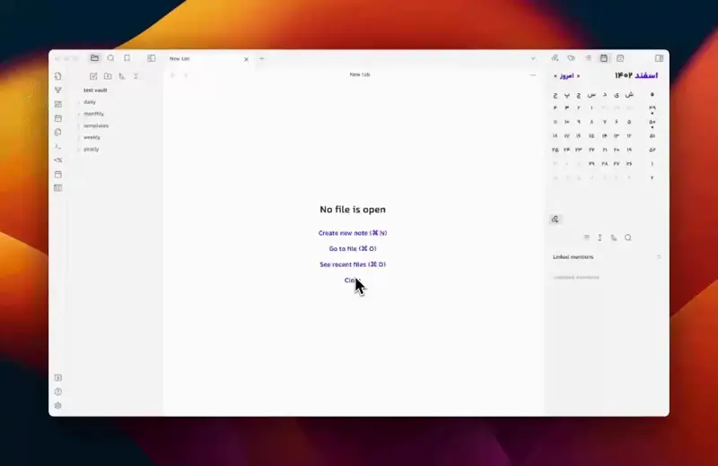
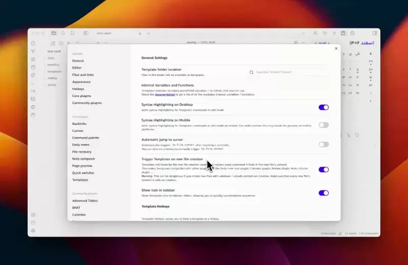
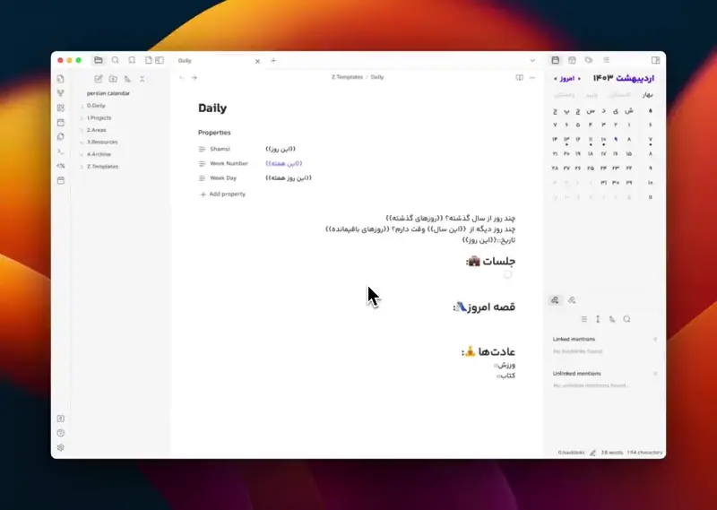
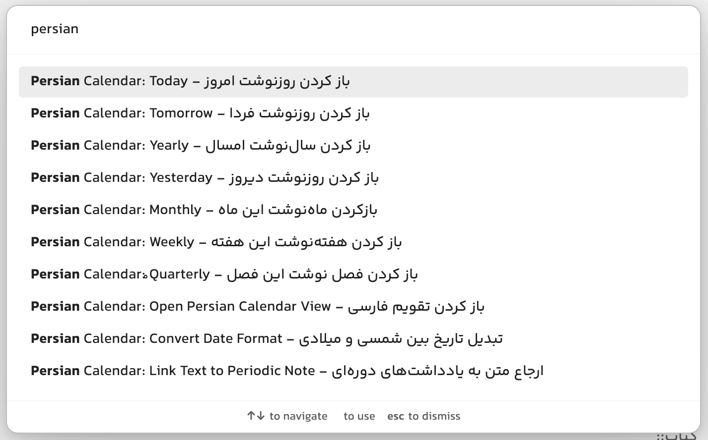
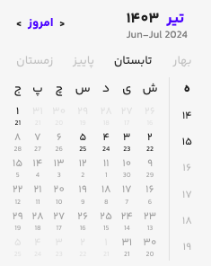

# Obsidian Persian Calendar

This tool lets you see events, add and organize notes from daily to yearly on the Persian calendar, use templates with placeholders, and works with all Obsidian daily plugins.

## Usage

- Can add daily, weekly, monthly, quarterly and yearly notes based on Persian calendar.
- Modify path for creating notes.
- Can reference notes by typing `@` or selecting them.
- Can add {{placeholders}} in templates to enrich your templates. Works fine with [Templater](https://github.com/SilentVoid13/Templater) plugin for note templates.
- Works fine with all obsidian daily plugins.
- Works with Georgian and Hijri calendar in one view.
- Showing events of Iranian official calendar.

# افزونه تقویم فارسی ابسیدین

این افزونه تقویم فارسی را به [ابسیدین](https://obsidian.md/) اضافه می‌کند و شما می‌توانید بااستفاده از آن روزنوشت‌، هفته‌نوشت، ماه‌نوشت، فصل‌نوشت و سال‌نوشت تولید کنید و آن‌ها را مدیریت کنید، به آسانی به آن‌ها ارجاع دهید و نوشته‌هایتان را غنی‌تر کنید.

## قابلیت‌ها

- ایجاد یادداشت‌های روزانه، هفتگی، ماهانه، فصلی و سالانه
- برای یادداشت‌های روزانه و هفتگی موجود در فولدری که تعریف شده است یک نقطه زیر آن‌ها نمایش داده می‌شود.
- سازگاری کامل با افزونه Templater
- سازگاری با تم‌های اصلی ابسیدین
- امکان رفرنس دادن به یادداشت‌ها از طریق تایپ کردن '@' یا سلکت کردن عبارت‌ها برای قالب‌ها.
- امکان قرار دادن {{عبارت‌های معنادار}} در قالب‌ها برای غنی‌تر کردن یادداشت‌ها
- ذخیره‌سازی فایل‌های روزنوشت به میلادی برای سازگاری بیشتر با افزونه‌های ابسیدین
- قابلیت نمایش همزمان تقویم میلادی و قمری
- نمایش رویدادهای تقویم شمسی و میلادی و هجری
- امکان تنظیم نمایش رویدادها

## راهنمای نصب

این افزونه در مخزن افزونه‌های ابسیدین نمایه شده است. برای نصب افزونه کافیست از طریق تنظیمات در بخش Community plugins نام Persian Calendar را جستجو کنید و افزونه را نصب کنید. بعد از فعالسازی افزونه در صورتی که افزونه را در سایدبار سمت چپ نمی‌بینید، با دستور «باز کردن تقویم فارسی» آن را در سایدبار باز کنید. پس از اجرای دستور، افزونه باید در سایدبار سمت چپ بالا به شما نمایش داده شود.

## راهنمای استفاده

پس از نصب افزونه اولین کار مهم تعریف مسیرهای ایجاد فایل‌هاست. برای این کار به تنظیمات افزونه رفته و مسیرهای تولید فایل‌ها را مطابق توضیحات درج شده مشخص کنید. قبل از تنظیم مسیر، آن را در ابسیدین ایجاد کنید و برای تعریف کردن مسیر ابتدای آن `/` نگذارید. مسیر تعریف فایل را از ریشه اصلی ارجاع دهید.
پس از مشخص کردن مسیرها برای مشخص کردن قالب تولید افزونه [Templater](https://github.com/SilentVoid13/Templater) را نصب کنید و مسیر قالب‌ها را مشخص کنید.

## آموزش استفاده به همراه افزونه Templater

با استفاده از افزونه [Templater](https://github.com/SilentVoid13/Templater) می‌توانید قالب‌های مشخصی را برای یاداشت‌های روزانه، هفتگی، ماهانه، فصلی و سالانه خود مشخص کنید:
کافیست افزونه [Templater](https://github.com/SilentVoid13/Templater) را نصب کنید و مطابق تصویر زیر برای هر نوع از فایل‌ها یک قالب به افزونه معرفی کنید. در نظر داشته باشید مسیرهایی که به افزونه معرفی می‌کنید با مسیرهای مشخص شده در تنظیمات افزونه یکسان باشد. حتما باید گزینه Trigger Templater on new file creation روشن باشد. برای غنی‌تر کردن قالب‌ها حتما بخش عبارت معنادار این افزونه را مطالعه کنید.

## امکان درج عبارت معنادار در قالب‌ها

میتوانید با درج عبارت‌های معنادار زیر تاریخ‌ها را در قالب‌ها اضافه کنید:

- `{{امروز}}‍‍`: تاریخ شمسی امروز را در یادداشت قرار می‌دهد. اگر میخواهید بدانید هر روز چه یادداشت‌هایی ایجاد کردید آن را در همه یادداشت‌هایتان قرار دهید. (توصیه میکنم حتما این کار را انجام دهید!)
- `{{این روز}}`: بر اساس تاریخ روزنوشت تاریخ مرتبط با آن روز به شمسی را در فرمت مثلا `1403-02-01` بر می‌گرداند. اگر تاریخ افزونه را میلادی گذاشته‌اید میتوانید با این عبارت تاریخ شمسی هر روزنوشت را در آن درج کنید.
- `{{روز هفته}}`: به شما عنوان امروز را برمی‌گرداند. اگر میخواهید بدانید هر یادداشت مرتبط با کدام روزهفته است میتوانید این را در متن یادداشت قرار دهید.
- `{{این روز هفته}}`: روز هفته روزنوشت را به شما برمیگرداند.
- `{{هفته}}`: شماره هفته را در فرمت مثلا `1402-W3` امروز را به شما برمیگرداند. اگر میخواهید بدانید در کدام هفته این یادداشت تولید شده این را در یادداشت‌هایتان قراردهید.
- `{{این هفته}}`: شماره هفته مرتبط با روزنوشت را به شما برمیگرداند.
- `{{ماه}}`: شماره ماه را فرمت `1403-02` برمیگرداند. اگر میخواهید بدانید در کدام ماه این یادداشت تولید شده میتوانید این عبارت را در یادداشت‌هایتان قرار دهید.
- `{{این ماه}}`: شماره ماه هر روزنوشت را برمیگرداند.
- `{{فصل}}`: شماره فصل را در فرمت `1403-Q1` برمیگرداند.  اگر میخواهید بدانید این یادداشت در کدام فصل تولید شده میتوانید این را در یادداشت‌هایتان قرار دهید.
- `{{این فصل}}`: شماره فصل مرتبط با روزنوشت را برمیگرداند.
- `{{سال}}`: سال را در فرمت `1403` برمیگرداند. اگر میخواهید بدانید این یادداشت در کدام سال تولید شده میتوانید این عبارت را در نوشته‌هایتان قرار دهید.
- `{{این سال}}`: سال مرتبط با روزنوشت را برمیگرداند.
- `{{روزهای گذشته}}`: تعداد روزهای گذشته از ابتدای سال را بر اساس روزنوشت به شما برمیگرداند.
- `{{روزهای باقیمانده}}`: روزهای باقیمانده تا پایان سال را بر اساس روزنوشت به شما برمیگرداند.
- `{{اول هفته}}`: بر اساس تنظیمات شما روز اول هفته‌نوشت را به شمسی یا میلادی برمیگرداند.
- `{{آخر هفته}}`: بر اساس تنظیمات شما روز آخر هفته‌نوشت را به شمسی یا میلادی برمیگرداند.
- `{{اول ماه}}`: بر اساس تنظیمات شما روز اول ماه‌نوشت را به شمسی یا میلادی برمیگرداند.
- `{{آخر ماه}}`: بر اساس تنظیمات شما روز آخر ماه‌نوشت را به شمسی یا میلادی برمیگرداند.
- `{{مناسبت‌}}`: مناسبت‌های هر روز را بر اساس تنظیماتی که در تقویم اعمال شده و در تولتیپ نمایش داده می‌شود را در روزنوشت درج می‌کند.

دقت داشته باشید باید دقیقا این عبارت ها با همین فرمت در روزنوشت‌ها درج شود.
این قابلیت افزونه با طور کامل با قابلیت‌های افزونه `Templater` هماهنگ است و پس از ساخته شدن قالب توسط این افزونه با 500 میلی‌ثانیه تاخیر اجرا می‌شود.

## امکان ارجاع به یادداشت‌ها از طریق تایپ کردن '@' یا انتخاب کردن

میتوانید از طریق تایپ کردن نویسه '@' در وسط نوشته‌ها به یادداشت‌های خود ارجاع دهید. یادداشت‌های پشتیبانی شده تا به امروز:

- روزهای جاری به صورت `امروز`، `دیروز`، `فردا`، `پریروز` و `پس‌فردا` (هماهنگ با تنظیم میلادی و خورشیدی)
- روزهای هفته:روز هفته(روز هفته جاری)، روز هفته بعد، روز هفته قبل (هماهنگ با تنظیم میلادی و خورشیدی)؛ نکته: اگر مثلا دوشنبه باشد و شما یکشنبه را انتخاب کنید یکشنبه بعدی انتخاب می‌شود. یکشنبه ای که گذشته است در تعریف این افزونه یکشنبه گذشته است و باید از عبارت یکشنبه قبل استفاده کنید.
- هفته‌ها به صورت `این هفته`، `هفته قبل` و `هفته بعد`
- ماه‌ها به صورت `این ماه`، `ماه قبل` و `ماه بعد`
- فصل‌ها به صورت `این فصل`، `فصل قبل` و `فصل بعد`
- سال‌ها به صورت `امسال`، `سال قبل` و `سال بعد`
همچنین میتوانید با انتخاب کردن عبارت‌های فوق را به روزنوشت‌ها لینک کنید. مثلا اگر فردا را انتخاب کنید و انتخاب دستور مرتبط یادداشت‌ها را لینک کنید. فیلم زیر را برای درک بهتر این موضوع ببینید. در نظر داشته باشید به صورت پیش‌فرض این افزونه فایل‌ها را نمی‌سازد و خودتان باید فایل‌ها را ازطریق افزونه بسازید. 

## امکان نامگذاری یادداشت‌ها بر اساس تقویم میلادی

بسیاری از افزونه‌های ابسیدین بر اساس تاریخ میلادی فعالیت می‌کنند. در تنظیمات می‌توانید مشخص کنید که یادداشت‌ها به صورت میلادی نام‌گذاری شوند و با استفاده از `{{عبارت‌های معنادار}}` تقویم شمسی را به آن‌ها اضافه کنید. می‌توانید با انتخاب این موضوع تمامی قابلیت‌های افزونه را هماهنگ با افزونه‌های مختلف ابسیدین که با روزنوشت‌ها کار می‌کنند داشته باشید.

## دستورات تعریف شده در افزونه

برای سهولت در دسترسی به فایل‌های روزهای مختلف دستورات زیر در افزونه قرار دارد که می‌توانید برای آن‌ها شورتکات تعریف کنید.

- دسترسی به روزنوشت، هفته‌نوشت، ماه‌نوشت، فصل‌نوشت و سال‌نوشت جاری
- ارجاع متن سلکت شده به یادداشت مرتبط
- تبدیل تاریخ بین شمسی و میلادی به صورت خودکار و با فرمت‌های مختلف از جمله`1403/02/01` یا `14030201` یا`1403-02-01` . (سال بیشتر 1500 میلادی و کمتر آن شمسی است.این حرکت اشتباه اما کار راه‌اندازتر است!)

## قابلیت نمایش تقویم میلادی

اگر از تقویم میلادی زیاد استفاده می‌کنید و می‌خواهید همزمان در افزونه تقویم میلادی نمایش داده ‌شود می‌توانید در تنظیمات افزونه با فعال‌سازی آن، تقویم میلادی را در کنار تقویم شمسی داشته باشید.

## قابلیت نمایش تقویم قمری و میلادی به صورت همزمان

در تنظیمات تقویم میتوانید مشخص کنید تقویم قمری نمایش داده شود یا خیر. این تنظیمات باعث میشود که بتوانید در کنار تقویم شمسی و میلادی تقویم قمری را هم داشته باشید.

## تنظیم نمایش مناسبت‌های در تقویم

مناسبت‌های تقویم ایران به این افزونه اضافه شده است. میتوانید تنظیم کنید در تولتیپ (وقتی موس را روی روز قرار می‌دهید باکسی نمایش داده می‌شود که به آن تولتیپ می‌گویند) چه رویدادهایی را نمایش دهد. به صورت معمول سه دسته رویداد در تقویم ایران وجود دارد: 

- رویدادهای تقویم رسمی: این رویدادها به صورت رسمی در کشور تصویب شده‌اند
- رویدادهای باستانی:‌ رویدادهای که در تقویم باستانی ایران وجود دارد
- رویدادهای شیعی: رویدادهایی که در تقویم شیعیان درج شده است و با تقویم هجری تنظیم شده است. تقویم رسمی ایران با برخی از رویدادهای شیعی تقارن دارد. بنابراین اگر مایلید رویدادهای تقویم رسمی ایران را داشته باشید همزمان رویدادهای شیعی را فعال کنید.

## مسیر مشارکت در توسعه افزونه

این افزونه به صورت رایگان و برای مقاصد غیرتجاری و مطابق [این لایسنس](LICENSE) توسعه یافته است و با مشارکت شما کامل‌ می‌شود. در تب Issues همین مخزن می‌توانید ایده‌ها و باگ‌ها را گزارش کنید. هم‌چنین در تلاشم در سایت و فروم [کارفکر](https://karfekr.ir) مطالب مرتبط با ابسیدین را به اشتراک بگذارم. اگر مایل هستید که توسعه دهنده این افزونه را حمایت کنید [کارفکر](https://karfekr.ir) را دنبال کنید.
